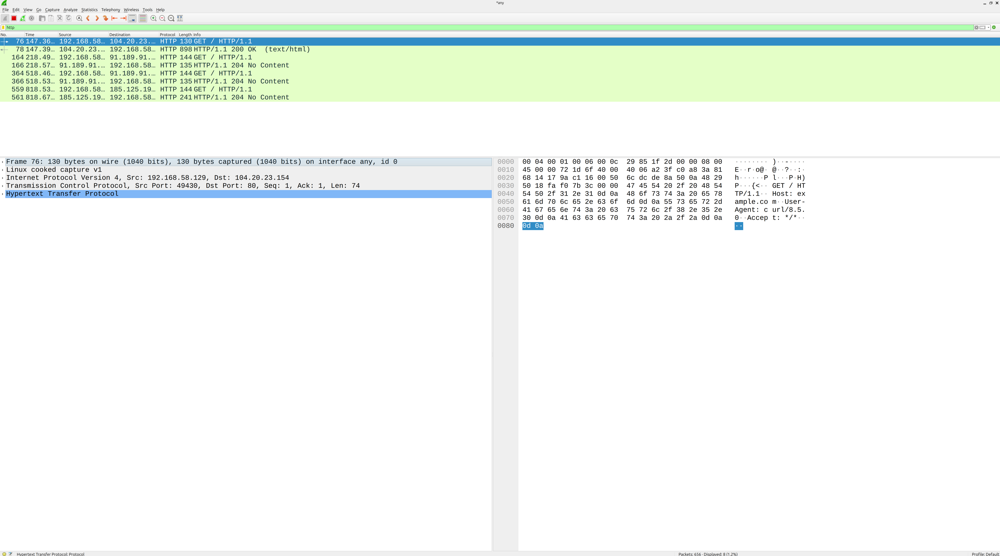
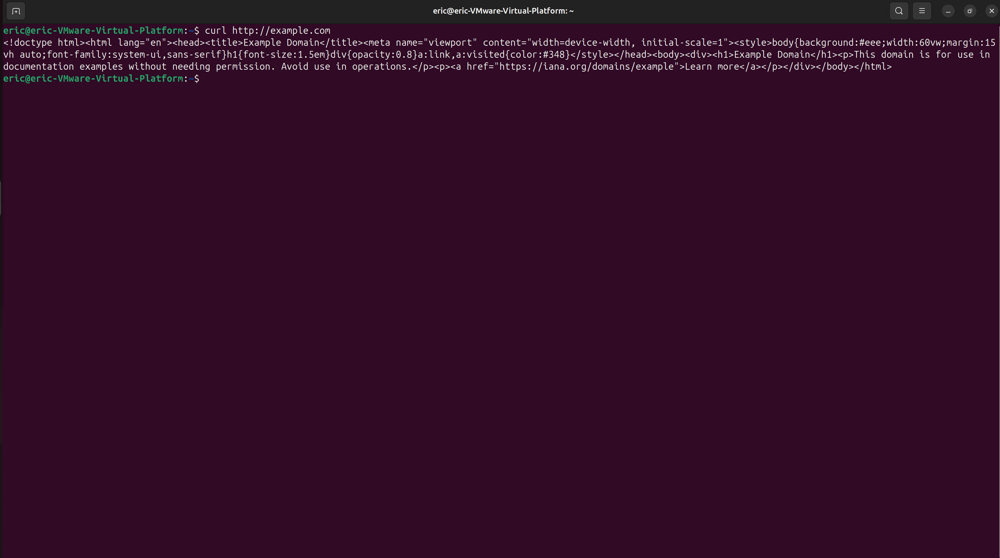
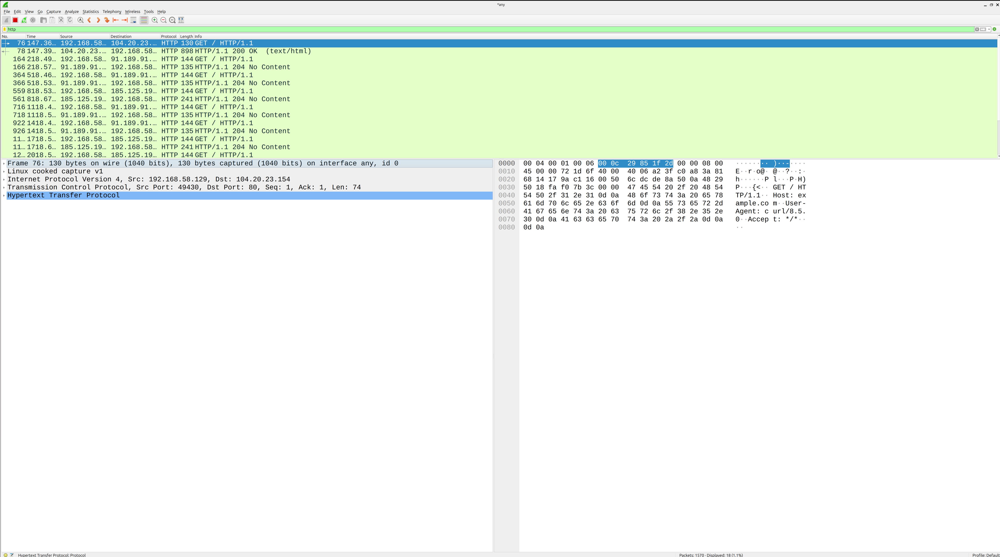

# SOC Lab 08 — HTTP Traffic Analysis

## Table of Contents
1. [Executive Summary](#executive-summary)
2. [Incident Ticket (ServiceNow Simulation)](#incident-ticket-servicenow-simulation)
3. [Lab Objectives](#lab-objectives)
4. [Environment Overview](#environment-overview)
5. [Detection Workflow](#detection-workflow)
6. [Traffic Analysis](#traffic-analysis)
7. [Detection Engineering Insights](#detection-engineering-insights)
8. [Evidence](#evidence)
9. [Conclusions](#conclusions)
10. [Next Steps](#next-steps)

---

## Executive Summary

This lab focuses on capturing and analyzing HTTP traffic to understand how web communication appears in packet captures.

HTTP is a fundamental protocol used for web communication and is commonly observed in network environments. Security analysts must understand how HTTP requests and responses appear in traffic in order to detect suspicious activity such as data exfiltration, command-and-control communication, or malicious web requests.

In this lab, HTTP traffic was generated and captured using Wireshark. The captured traffic was then analyzed to identify request methods, response codes, and protocol behavior relevant to SOC investigations.

This lab demonstrates how analysts inspect web traffic and build foundational skills for application-layer visibility and threat detection.

---

## Incident Ticket (ServiceNow Simulation)

**Incident ID:** INC-0008
**Date/Time Detected:** 2026-04-24 09:00
**Detected By:** SOC Analyst (Lab Simulation)
**Severity:** Low
**Category:** Network Security
**Subcategory:** HTTP

---

### Short Description
Standard HTTP GET request activity observed from 127.0.0.1 to external domain (example.com).

---

### Detailed Description
During packet capture, HTTP traffic was generated using the `curl` command to request the domain `example.com`.

Packet analysis revealed standard HTTP request and response behavior between the local system and the web server. The observed traffic includes an HTTP GET request followed by a corresponding response containing the requested content.

---

### Indicators of Compromise (IOCs)
- Source IP: 127.0.0.1
- Destination Domain: example.com
- Protocol: HTTP

---

### Analysis
Packet inspection confirmed normal HTTP request and response patterns with no anomalies observed.

The HTTP request and response sequence is consistent with expected web communication behavior. No indicators of suspicious or malicious activity were identified during analysis.

---

### Impact Assessment
- No external threat observed; activity limited to local lab environment
- No system compromise detected

---

### Response Actions Taken
- Captured traffic using Wireshark
- Applied HTTP filter (`http`)
- Analyzed packet structure and request/response behavior
- Documented findings

---

### Recommended Actions
- Continue monitoring HTTP traffic for unusual request patterns
- Implement alerting for suspicious or repetitive web requests
- Monitor for connections to low-reputation domains
- Tune alert thresholds to reduce false positives in controlled environments

---

### Status
Closed (No Threat Identified)

---

## Lab Objectives

- Generate HTTP traffic in a controlled environment
- Capture HTTP requests and responses using Wireshark
- Identify key HTTP methods (GET, POST)
- Analyze HTTP response status codes
- Understand how web traffic appears in packet captures
- Develop application-layer analysis skills relevant to SOC operations

---

## Environment Overview

**Operating System:** Ubuntu Linux (Virtual Machine)

**Tools Used**
- Wireshark
- curl

**Network Setup**
- Localhost and external web traffic
- Single VM environment

---

## Detection Workflow

### 1. Start Packet Capture in Wireshark

Wireshark was used to capture live HTTP traffic for analysis. The capture was initiated on the active network interface prior to generating HTTP requests.

---

### 2. Generate HTTP Traffic

HTTP traffic was generated using the `curl` command to request a web page.

**Command:**

```bash
curl http://example.com
```

---

### 3. Apply Wireshark Filter

The HTTP display filter was applied to isolate web traffic from the full packet capture.

**Filter:**

---

### 4. Analyze Captured Packets

Captured packets were inspected to identify HTTP request methods, response codes, and protocol behavior.

---

## Traffic Analysis

### HTTP GET Request

The `curl` command issued an HTTP GET request to `example.com`. The request was visible in Wireshark and included standard HTTP headers such as Host, User-Agent, and Accept.

### HTTP Response

The server responded with an HTTP 200 OK status code, confirming the request was successfully processed. The response body contained the HTML content of the requested page.

### Protocol Behavior

The traffic followed standard HTTP/1.1 communication patterns including TCP connection establishment, request transmission, response delivery, and connection termination.

---

## Detection Engineering Insights

- HTTP traffic is unencrypted and fully readable in packet captures
- Analysts can inspect request URIs, headers, and response bodies directly
- Suspicious patterns include unusual User-Agent strings, repeated requests to the same URI, and unexpected destination domains
- HTTP is a common channel for data exfiltration and C2 communication in real-world attacks
- Filtering by `http` in Wireshark quickly isolates web traffic for analysis

---

## Evidence

All screenshots are stored in the repository and demonstrate HTTP request generation and packet-level analysis.





---

## Conclusions

This lab demonstrated the process of generating, capturing, and analyzing HTTP traffic using Wireshark. HTTP is a foundational protocol in SOC operations and understanding its behavior at the packet level is essential for detecting web-based threats.

The analysis confirmed normal request and response patterns with no indicators of malicious activity. This lab builds the skills necessary to identify anomalous HTTP behavior in real-world environments.

---

## Next Steps

- Lab 09: Suspicious HTTP Traffic Analysis
- Detect anomalous web behavior including unusual URIs, unexpected domains, and suspicious request patterns
- Build stronger analyst narrative around detection-focused HTTP analysis
- Continue developing application-layer visibility skills
